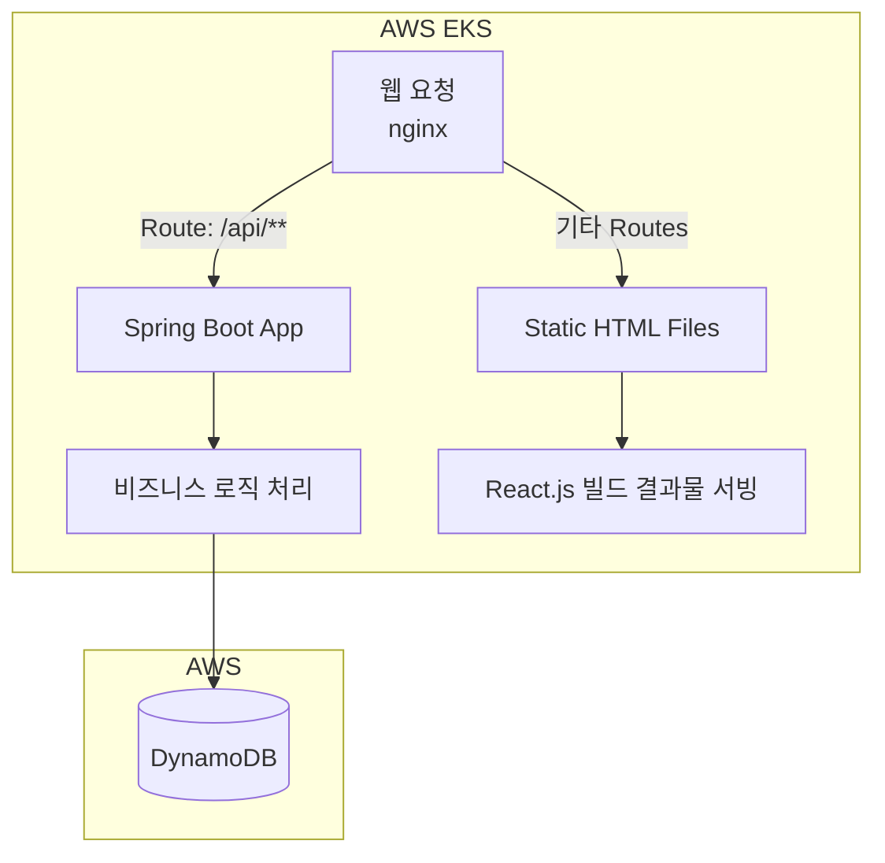
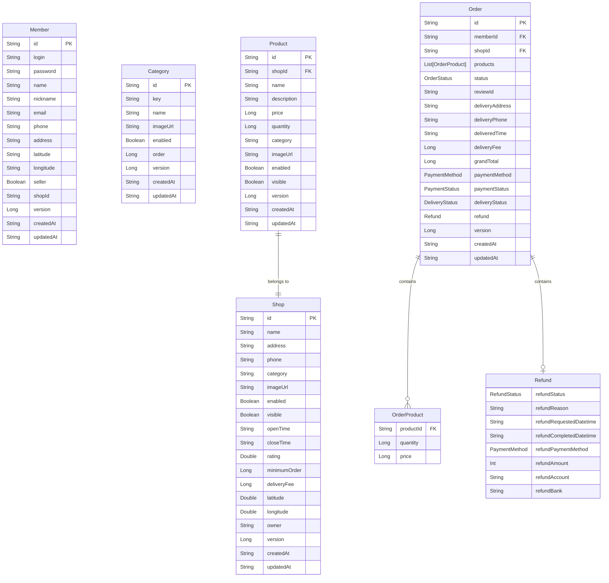

# Level 2: 시스템 설계
## Task 4
- 소제목: 시스템 아키텍처 설계(모듈 구성, 기술 스택 선택: AWS, Spring Webflux, Kotlin)
- 멘토 코멘트: 필요한 기술 스택을 결정하고 아키텍처를 결정합니다.
- 소요시간: 30분
- 답변 Type : 장문형

앞서 AWS로 개발을 진행하기로 했는데요.
AWS 기술 중 확장성과 이식성이 뛰어난 EKS를 사용하고자합니다.
그리고 DynamoDB를 통해 복잡한 설정 없이 빠르게 개발을 진행하려합니다.

API는 팀에서 사용하던 Spring WebFlux와 Kotlin을 사용하려고 하는데요.
방금 말씀드린 기술들을 정리해주세요.

시스템은 크게 백엔드와 프론트엔드로 나누어 설계하려고합니다.
프론트엔드는 FE팀에서 React.js로 개발한 정적 파일들을 제공받아 nginx를 통해 직접 서빙하려합니다.
백엔드는 저희팀에서 개발한 jar 파일을 실행시켜 nginx를 통해 reverse proxy로 연결하려합니다.
백엔드는 /api/** 엔드포인트에 대해서만 라우팅을 진행하고자합니다.

위에서 설명드린 전체적인 설계도를 간단하게 그려주세요.

- 정답:
1. EKS는 AWS에서 제공하는 Kubernetes 클러스터로 운영이 편리하고 확장성이 용이합니다. 또한 도커 이미지로 앱을 배포할 수 있어 어떤 환경에서도 쉽게 서비스를 운영할 수 있는 장점이 있습니다
    DyanamoDB는 AWS에서 제공하는 NoSQL 데이터베이스로 빠르고 확장성이 뛰어나며 키-값 저장소로 사용하기에 편리합니다.
    Spring Webflux는 비동기 및 논블로킹 I/O를 지원하는 스프링 프레임워크의 모듈로, 반응형(reactive) 프로그래밍을 통해 높은 확장성과 성능을 제공합니다. 
    Kotlin은 JVM 위에서 실행되며, 간결하고 안전한 문법을 제공하는 현대적인 프로그래밍 언어입니다. Java에서 활용하기 어려운 null safety, 함수형 프로그래밍 등을 지원합니다.
2.  설계도

nginx를 통해 인터넷 트래픽을 수신합니다.
/api/** route는 스프링 부트 앱으로 전달하고,
나머지 route는 프론트 앤드 정적 파일들을 서빙합니다.
스프링부트 앱은 비즈니스 로직을 처리하며 DynamoDB를 통해 영속성을 제공합니다.

## Task 5
- 소제목: RESTful API 설계(경로, 메서드, 요청/응답 정의)
- 멘토 코멘트: API 인터페이스를 정의합니다.
- 소요시간: 30분
- 답변 Type : 장문형

앞서 핵심 기능을 정리해보았는데요.
인증 관리(회원가입/로그인), 가게 검색, 가게 조회(목록/상세), 주문 관리 4가지가 있었습니다.

각 기능 별로 RESTful API 인터페이스를 설계해주세요.
정의된 인터페이스를 통해 프론트엔드와 통신을 진행하려합니다.

RESTful API는 GET, POST, PUT, DELETE의 메서드로
지정한 URI에 필요한 요청을 보낼 수 있으며 메서드와 URL로 그 기능을 유추할 수 있어야합니다.

API의 기본 엔드포인트는 /api/v1/ prefix를 가지려합니다.
실무에서 흔한 관행으로 api의 버전이 변경될 때 중간의 v1을 변경하면서
점진적으로 서비스를 발전시켜나갈 수 있습니다.

인증 관리에서는 회원가입, 로그인, 로그아웃, 내 정보 조회 기능이 필요하고 /api/v1/auth/의 prefix를 가집니다.
가게 검색에서는 가게명 및 메뉴명으로 검색하는 기능이 필요하고 /api/v1/search의 endpoint를 가집니다.
가게 조회에서는 목록 조회, 상세 조회 기능이 필요하고 /api/v1/shops/의 prefix를 가집니다.
주문 관리에서는 주문 생성, 목록 조회, 상세 조회 기능이 필요하고 /api/v1/orders의 prefix를 가집니다.

추가로, 홈화면에서 노출할 /api/v1/categories 엔드포인트도 있습니다.
이는 가게의 카테고리 종류를 응답합니다.

- 정답
제공드린 api-spec.md 파일을 참고하여 endpoint를 설계합니다.
아래 링크와 동일합니다.
https://github.com/nexusorder/orderflow/blob/main/asset/api-spec.md

인터페이스 명세는 [코드 저장소](https://github.com/nexusorder/orderflow)에서 Spring boot app을 실행(./gradlew bootRun)한 후
http://localhost:8080/docs에 접속하거나 asset/swagger/index.html를 통해 확인할 수 있습니다.
설정된 계정은 name: user, password: 6519ce2e-51f1-496b-ae9e-d3fc6b092a6f 입니다.

## Task 6
- 소제목: 데이터베이스 설계(ERD 작성, 테이블 및 관계 정의)
- 멘토 코멘트: 
- 소요시간: 90분
- 답변 Type : 장문형

앞에서 작성한 API에 따라 데이터가 데이터베이스에 저장 및 조회가 되어야하는데요.
DynamoDB라는 NoSQL를 쓰기로 결정했으니 NoSQL에 적합한 스키마로 작성해야합니다.
회원 정보, 가게 정보, 상품 정보 등을 저장하기에 필요한 칼럼 및 데이터 구조를 검토해서
테이블을 정의하고, 관계를 정리, ERD를 작성해주세요.

- 정답

테이블 정의
이름 | 정의
-- | --
Member | 회원 정보
Category | 가게 및 상품 카테고리
Shop | 가게 정보
Product | 상품 정보
Order | 주문 정보

Product의 shopId는 Shop의 id에 대한 왜래키입니다.
Order 내 memberId는 Member의 id에 대한 왜래키입니다.
Order 내 shopId는 Shop의 id에 대한 왜래키입니다.
Order 내 products 내 OrderProduct의 shopId는 Shop의 id에 대한 왜래키입니다.

