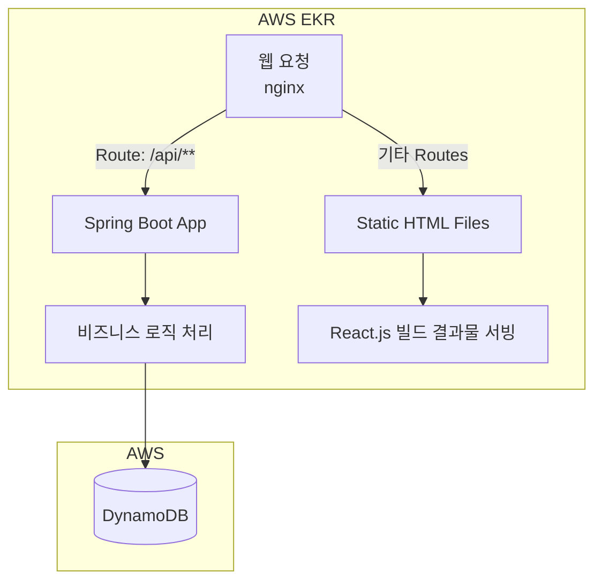
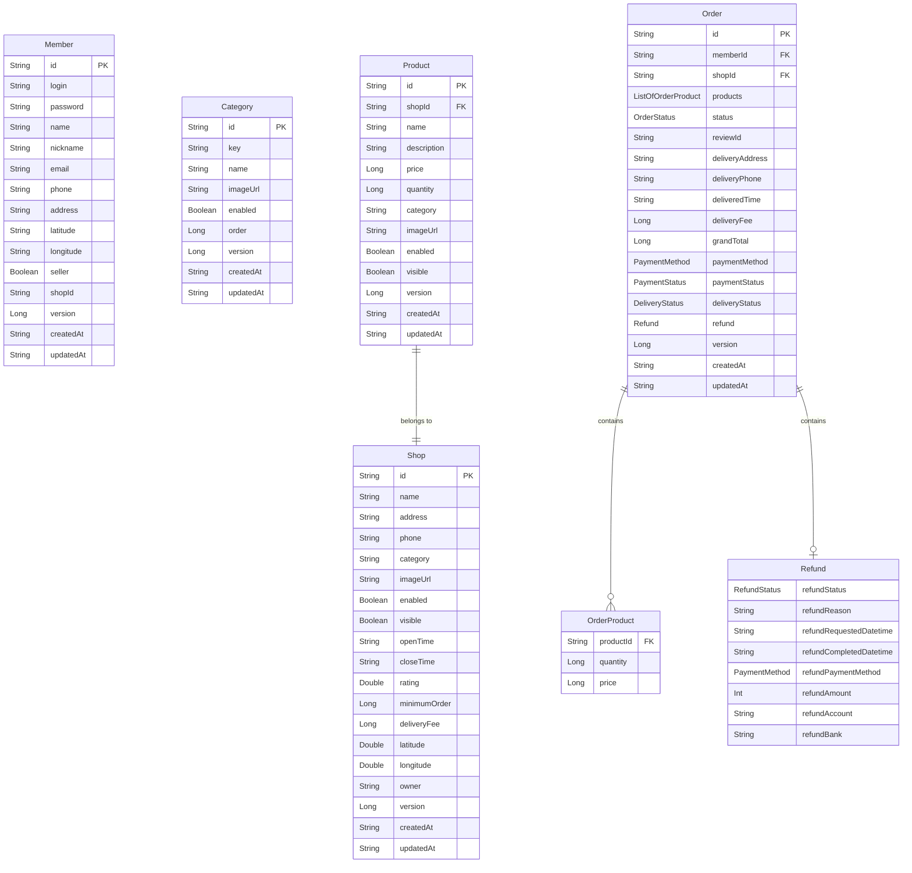

# Level 2: 시스템 설계
## Task 4
- 소제목: 시스템 아키텍처 설계(모듈 구성, 기술 스택 선택: AWS, Spring Webflux, Kotlin)
- 멘토 코멘트: 필요한 기술 스택을 결정하고 아키텍처를 결정합니다.
- 소요시간: 30분
- 답변 Type : 장문형

앞서 AWS로 개발을 진행하기로 했는데요.
AWS 기술 중 확장성과 이식성이 뛰어난 EKS를 사용하고자합니다.
DynamoDB를 통해 복잡한 설정 없이 빠르게 개발을 진행합니다.
API는 팀에서 사용하던 Spring Webflux와 Kotlin을 사용하려고 하는데요.
방금 말씀드린 기술들을 정리해주시고 전체적인 설계도를 개괄적으로 작성해주세요.

- 정답:
1. EKS는 AWS에서 제공하는 Kubernetes 클러스터로 운영이 편리하고 확장성이 용이합니다.
    DyanamoDB는 NoSQL 데이터베이스로 확장성이 뛰어나고 키-값 저장소로 사용하기 편리합니다.
    Spring Webflux는 Spring Framework의 하위 요소로 비동기 서버 프로그래밍에 적합한 도구입니다.
    Kotlin은 Java와 100% 호환되는 언어로 null safety, 함수형 프로그래밍 등을 지원합니다.
2.  설계도

```mermaid
graph TD
    A[웹 요청<br/>nginx] -->|Route: /api/**| B[Spring Boot App]
    A -->|기타 Routes| C[Static HTML Files]
    B --> D[비즈니스 로직 처리]
    D --> F[(DynamoDB)]
    C --> E[React.js 빌드 결과물 서빙]
    subgraph AWS EKR
        A
        B
        C
        D
        E
    end
    subgraph AWS
        F
    end
```

nginx를 통해 인터넷 트래픽을 수신합니다.
/api/** route는 스프링 부트 앱으로 전달하고,
나머지 route는 프론트 앤드 정적 파일들을 서빙합니다.
스프링부트 앱은 비즈니스 로직을 처리하며 DynamoDB를 통해 영속성을 제공합니다.

## Task 5
- 소제목: RESTful API 설계(경로, 메서드, 요청/응답 정의)
- 멘토 코멘트: API 인터페이스를 정의합니다.
- 소요시간: 30분
- 답변 Type : 장문형

앞서 핵심 기능을 정리해보았는데요.
회원가입/로그인, 가게 검색, 장바구니, 주문 4가지가 있었습니다.
각 기능 별로 RESTful API 인터페이스를 설계해주세요.
정의된 인터페이스를 통해 프론트엔드와 통신을 진행하려합니다.

- 정답
아래와 같은 endpoint를 설계합니다.
각 인터페이스 명세는 코드 저장소에서 Spring boot app을 실행한 후
http://localhost:8080/docs에 접속하거나 asset/swagger/index.html를 통해 확인할 수 있습니다.

```py
# 인증(auth-controller)
POST /api/v1/auth/signup # 회원가입
## request
### body
{
  "login": "string",
  "password": "string",
  "passwordConfirm": "string",
  "name": "string",
  "nickname": "string",
  "phone": "string",
  "email": "string",
  "address": "string",
  "latitude": 64,
  "longitude": 64,
  "isValid": true
}
## response
### body
{
  "success": true,
  "data": true,
  "errorCode": 0,
  "errorMessage": "string"
}

POST /api/v1/auth/login # 로그인
## request
### body
{
  "login": "string",
  "password": "string"
}
## response
### body
{
  "success": true,
  "data": true,
  "errorCode": 0,
  "errorMessage": "string"
}

POST /api/v1/auth/logout # 로그아웃
## request
### body
## response
### body
{
  "success": true,
  "data": true,
  "errorCode": 0,
  "errorMessage": "string"
}

GET /api/v1/auth/profile # 내 정보 조회
## request
### body
## response
### body
{
  "success": true,
  "data": {
    "login": "string",
    "name": "string",
    "nickname": "string",
    "email": "string",
    "phone": "string",
    "address": "string",
    "latitude": 0,
    "longitude": 0,
    "seller": true
  },
  "errorCode": 0,
  "errorMessage": "string"
}

# 카테고리(category-controller)
GET /api/v1/categories # 카테고리 조회
## request
## response
### body
{
  "success": true,
  "data": [
    {
      "key": "string",
      "name": "string",
      "imageUrl": "string",
      "enabled": true,
      "order": 0
    }
  ],
  "errorCode": 0,
  "errorMessage": "string"
}

# 가게(shop-controller)
GET /api/v1/shops # 가게 전체 조회
## request
## response
### body
{
  "success": true,
  "data": [
    {
      "id": "string",
      "name": "string",
      "address": "string",
      "phone": "string",
      "email": "string",
      "imageUrl": "string",
      "isOpened": true,
      "enabled": true,
      "openTime": "string",
      "closeTime": "string",
      "category": "string",
      "products": [
        {
          "shopId": "string",
          "name": "string",
          "description": "string",
          "price": 0,
          "category": "string",
          "imageUrl": "string",
          "enabled": true,
          "id": "string"
        }
      ],
      "minimumOrder": 0,
      "deliveryFee": 0,
      "rating": 0,
      "latitude": 0,
      "longitude": 0
    }
  ],
  "errorCode": 0,
  "errorMessage": "string"
}

GET /api/v1/shops/{id} # 가게 상세 조회
## request
## response
### body
{
  "success": true,
  "data": {
    "id": "string",
    "name": "string",
    "address": "string",
    "phone": "string",
    "email": "string",
    "imageUrl": "string",
    "isOpened": true,
    "enabled": true,
    "openTime": "string",
    "closeTime": "string",
    "category": "string",
    "products": [
      {
        "shopId": "string",
        "name": "string",
        "description": "string",
        "price": 0,
        "category": "string",
        "imageUrl": "string",
        "enabled": true,
        "id": "string"
      }
    ],
    "minimumOrder": 0,
    "deliveryFee": 0,
    "rating": 0,
    "latitude": 0,
    "longitude": 0
  },
  "errorCode": 0,
  "errorMessage": "string"
}

# 검색(search-controller)
POST /api/v1/search # 가게 및 상품 검색
## request
## response
### body
{
  "success": true,
  "data": [
    {
      "id": "string",
      "name": "string",
      "address": "string",
      "phone": "string",
      "email": "string",
      "imageUrl": "string",
      "isOpened": true,
      "enabled": true,
      "openTime": "string",
      "closeTime": "string",
      "category": "string",
      "products": [
        {
          "shopId": "string",
          "name": "string",
          "description": "string",
          "price": 0,
          "category": "string",
          "imageUrl": "string",
          "enabled": true,
          "id": "string"
        }
      ],
      "minimumOrder": 0,
      "deliveryFee": 0,
      "rating": 0,
      "latitude": 0,
      "longitude": 0
    }
  ],
  "errorCode": 0,
  "errorMessage": "string"
}

# 주문(order-controller)
GET /api/v1/orders
## request
## response
### body
{
  "success": true,
  "data": [
    {
      "memberId": "string",
      "shop": {
        "id": "string",
        "name": "string",
        "address": "string",
        "phone": "string",
        "email": "string",
        "imageUrl": "string",
        "isOpened": true,
        "enabled": true,
        "openTime": "string",
        "closeTime": "string",
        "category": "string",
        "products": [
          {
            "shopId": "string",
            "name": "string",
            "description": "string",
            "price": 0,
            "category": "string",
            "imageUrl": "string",
            "enabled": true,
            "id": "string"
          }
        ],
        "minimumOrder": 0,
        "deliveryFee": 0,
        "rating": 0,
        "latitude": 0,
        "longitude": 0
      },
      "products": [
        {
          "shopId": "string",
          "name": "string",
          "description": "string",
          "price": 0,
          "category": "string",
          "imageUrl": "string",
          "enabled": true,
          "id": "string",
          "quantity": 0
        }
      ],
      "status": "PENDING",
      "reviewId": "string",
      "deliveryAddress": "string",
      "deliveryPhone": "string",
      "deliveredTime": "string",
      "deliveryFee": 0,
      "grandTotal": 0,
      "paymentMethod": "EMPTY",
      "paymentStatus": "PENDING",
      "deliveryStatus": "PENDING",
      "refund": {
        "refundStatus": "PENDING",
        "refundReason": "string",
        "refundRequestedDatetime": "string",
        "refundCompletedDatetime": "string",
        "refundPaymentMethod": "EMPTY",
        "refundAmount": 0
      },
      "id": "string",
      "createdAt": "string"
    }
  ],
  "errorCode": 0,
  "errorMessage": "string"
}

POST /api/v1/orders
## request
### body
{
  "shopId": "string",
  "products": [
    {
      "productId": "string",
      "quantity": 0
    }
  ]
}

## response
### body
{
  "success": true,
  "data": "string",
  "errorCode": 0,
  "errorMessage": "string"
}

GET /api/v1/orders/{id}
## request
## response
### body
{
  "success": true,
  "data": {
    "memberId": "string",
    "shop": {
      "id": "string",
      "name": "string",
      "address": "string",
      "phone": "string",
      "email": "string",
      "imageUrl": "string",
      "isOpened": true,
      "enabled": true,
      "openTime": "string",
      "closeTime": "string",
      "category": "string",
      "products": [
        {
          "shopId": "string",
          "name": "string",
          "description": "string",
          "price": 0,
          "category": "string",
          "imageUrl": "string",
          "enabled": true,
          "id": "string"
        }
      ],
      "minimumOrder": 0,
      "deliveryFee": 0,
      "rating": 0,
      "latitude": 0,
      "longitude": 0
    },
    "products": [
      {
        "shopId": "string",
        "name": "string",
        "description": "string",
        "price": 0,
        "category": "string",
        "imageUrl": "string",
        "enabled": true,
        "id": "string",
        "quantity": 0
      }
    ],
    "status": "PENDING",
    "reviewId": "string",
    "deliveryAddress": "string",
    "deliveryPhone": "string",
    "deliveredTime": "string",
    "deliveryFee": 0,
    "grandTotal": 0,
    "paymentMethod": "EMPTY",
    "paymentStatus": "PENDING",
    "deliveryStatus": "PENDING",
    "refund": {
      "refundStatus": "PENDING",
      "refundReason": "string",
      "refundRequestedDatetime": "string",
      "refundCompletedDatetime": "string",
      "refundPaymentMethod": "EMPTY",
      "refundAmount": 0
    },
    "id": "string",
    "createdAt": "string"
  },
  "errorCode": 0,
  "errorMessage": "string"
}
```

## Task 6
- 소제목: 데이터베이스 설계(ERD 작성, 테이블 및 관계 정의)
- 멘토 코멘트: 
- 소요시간: 90분
- 답변 Type : 장문형

앞에서 작성한 API에 따라 데이터가 데이터베이스에 저장 및 조회가 되어야하는데요.
DynamoDB라는 NoSQL를 쓰기로 결정했으니 NoSQL에 적합한 스키마로 작성해야합니다.
회원 정보, 가게 정보, 상품 정보 등을 저장하기에 필요한 칼럼 및 데이터 구조를 검토해서
테이블을 정의하고, 관계를 정리, ERD를 작성해주세요.

- 정답

테이블 정의
이름 | 정의
-- | --
Member | 회원 정보
Category | 가게 및 상품 카테고리
Shop | 가게 정보
Product | 상품 정보
Order | 주문 정보

Product의 shopId는 Shop의 id에 대한 왜래키입니다.
Order 내 memberId는 Member의 id에 대한 왜래키입니다.
Order 내 shopId는 Shop의 id에 대한 왜래키입니다.
Order 내 products 내 OrderProduct의 shopId는 Shop의 id에 대한 왜래키입니다.



```mermaid
erDiagram
    Member {
        String id PK
        String login
        String password
        String name
        String nickname
        String email
        String phone
        String address
        String latitude
        String longitude
        Boolean seller
        String shopId
        Long version
        String createdAt
        String updatedAt
    }

    Category {
        String id PK
        String key
        String name
        String imageUrl
        Boolean enabled
        Long order
        Long version
        String createdAt
        String updatedAt
    }

    Shop {
        String id PK
        String name
        String address
        String phone
        String category
        String imageUrl
        Boolean enabled
        Boolean visible
        String openTime
        String closeTime
        Double rating
        Long minimumOrder
        Long deliveryFee
        Double latitude
        Double longitude
        String owner
        Long version
        String createdAt
        String updatedAt
    }
    
    Product {
        String id PK
        String shopId FK
        String name
        String description
        Long price
        Long quantity
        String category
        String imageUrl
        Boolean enabled
        Boolean visible
        Long version
        String createdAt
        String updatedAt
    }
    Product ||--|| Shop : "belongs to"

    Order {
        String id PK
        String memberId FK
        String shopId FK
        ListOfOrderProduct products
        OrderStatus status
        String reviewId
        String deliveryAddress
        String deliveryPhone
        String deliveredTime
        Long deliveryFee
        Long grandTotal
        PaymentMethod paymentMethod
        PaymentStatus paymentStatus
        DeliveryStatus deliveryStatus
        Refund refund
        Long version
        String createdAt
        String updatedAt
    }
    OrderProduct {
        String productId FK
        Long quantity
        Long price
    }
    Refund {
        RefundStatus refundStatus
        String refundReason
        String refundRequestedDatetime
        String refundCompletedDatetime
        PaymentMethod refundPaymentMethod
        Int refundAmount
        String refundAccount
        String refundBank
    }
    Order ||--o{ OrderProduct : contains
    Order ||--o| Refund : contains
```
